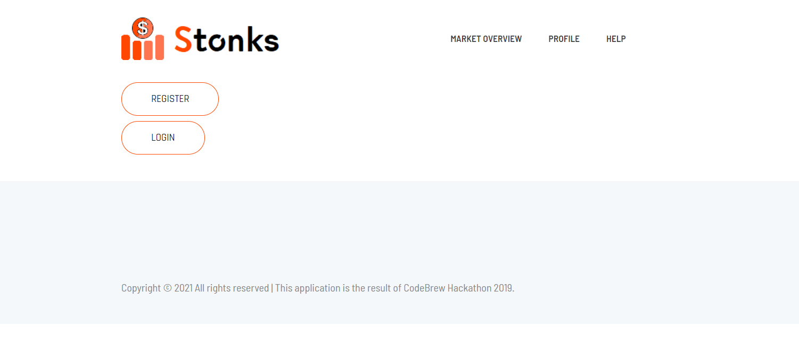
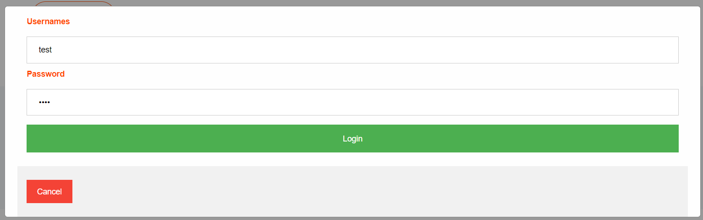

# Stock-market-simulator
ASP.NET based stock trading game, developed by the MVC architecture, using Entity framework.
Created for CodeBrew Hackathon in a team of 5, unfortunately unfinished. C# and MySQL used.

